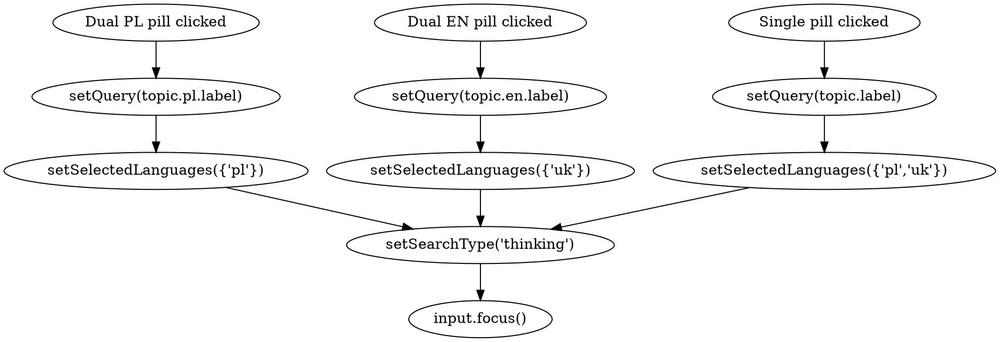

# Bilingual Drug & Crime Search Suggestions — Design

**Status:** Draft — awaiting user review
**Author:** Brainstorm session, 2026-05-12
**Scope:** "Popular searches" chips on `/search` empty state. Frontend only.

## Problem

The chips under the search input (`POPULAR_SEARCHES` in
`frontend/lib/styles/components/search/SearchForm.tsx`) ship today as a flat
list of three single-language labels:

```ts
{ label: "Kredyty frankowe",     mode: "thinking", languages: new Set(["pl"]) }
{ label: "Intellectual property", mode: "thinking", languages: new Set(["uk"]) }
{ label: "Prawo pracy",          mode: "thinking", languages: new Set(["pl"]) }
```

A Polish-speaking user clicking an English chip ends up searching the UK
corpus with an English phrase; a UK user has the same mismatch in reverse.
There is no signal that a topic exists in *both* corpora — drug-distribution
case-law, for example, is plentiful on both sides but the current chip set
exposes neither.

We also need the suggested-topic spine to reflect the corpus the platform is
currently optimised for: **drug crime** (criminal-case search is the primary
demo path).

## Goal

Replace `POPULAR_SEARCHES` with a bilingual topic set supporting **two chip
kinds**:

- **Dual-phrase topics** render as two adjacent pills — one Polish (searches
  PL corpus only with a Polish phrase) and one English (searches UK corpus
  only with an English phrase). For topics whose terminology is genuinely
  jurisdiction-specific (e.g. *posiadanie narkotyków* vs *drug possession*).
- **Single-phrase topics** render as one pill carrying a single English
  phrase plus a `PL+UK` badge. Clicking it enables both language filters and
  relies on the existing hybrid search path (Meili lexical + pgvector
  semantic via bge-m3 multilingual embeddings) to surface judgments from
  both corpora. For universal legal concepts (e.g. money laundering,
  conspiracy) where cross-lingual semantic matching adds value.

Clicking any pill sets the input text, sets the language toggle appropriately
for that pill's kind, and submits.

## Non-Goals

- The orphan `ExampleQueries.tsx` rabbit/thinking grid — gets deleted, not
  re-themed.
- Auto-detecting query language. The pill the user clicks declares intent.
- Surfacing topics dynamically from the Meili `topics` index. That is the
  separate criminal-topics-autocomplete feature
  ([[2026-05-11-criminal-case-search-topics-design]]). This spec is the
  static, hand-curated fallback shown when the input is empty.
- Internationalising surrounding chrome ("Popular searches" eyebrow). Out of
  scope for this change.
- Adding a `mode` selector per chip. Every chip stays `thinking` — same as
  today.

## Locked Topic List

Eight criminal / drug topics, six rendered as PL+EN dual pairs (12 pills)
and two rendered as single-phrase cross-lingual pills (2 pills) — **14
pills total**. Order matches user importance; flex-wrap handles narrow
widths.

### Dual-phrase topics (PL pill → PL corpus, EN pill → UK corpus)

| # | PL pill | EN pill |
|---|---------|---------|
| 1 | Posiadanie narkotyków | Drug possession |
| 2 | Wprowadzanie narkotyków do obrotu | Drug supply and distribution |
| 3 | Znaczna ilość narkotyków | Class A drug offences |
| 4 | Udzielanie narkotyków małoletnim | Supplying drugs to minors |
| 5 | Wymiar kary za przestępstwa narkotykowe | Sentencing for drug offences |
| 6 | Recydywa przy przestępstwach narkotykowych | Sentencing uplift for repeat drug offenders |

### Single-phrase cross-lingual topics (one pill, hybrid search)

| # | Pill (English; searches both PL+UK) |
|---|-------------------------------------|
| 7 | Money laundering from drug proceeds |
| 8 | Conspiracy to supply controlled drugs |

For all chip kinds the label *is* the query — they're short noun phrases
optimised for hybrid search. Single-phrase chips use English text on
purpose: the lexical match works directly against the UK corpus, and the
bge-m3 multilingual embedding handles the semantic match against the PL
corpus.

## Data Shape

Discriminated union on `kind`:

```ts
type SuggestedTopic =
  | {
      id: string;             // stable analytics key, kebab-case
      kind: "dual";
      pl: { label: string };  // shown + submitted to PL corpus
      en: { label: string };  // shown + submitted to UK corpus
    }
  | {
      id: string;
      kind: "single";
      label: string;          // shown + submitted; sets both PL+UK languages
    };

const SUGGESTED_TOPICS: SuggestedTopic[] = [
  { id: "drug-possession",
    kind: "dual",
    pl: { label: "Posiadanie narkotyków" },
    en: { label: "Drug possession" } },
  // ...5 more dual entries...
  { id: "money-laundering",
    kind: "single",
    label: "Money laundering from drug proceeds" },
  { id: "conspiracy",
    kind: "single",
    label: "Conspiracy to supply controlled drugs" },
];
```

The `mode: "thinking"` is a constant of the render function, not a per-row
field — it doesn't vary across the list. Keeping it out of the data avoids
inviting future contributors to set it ad-hoc.

The discriminated union (rather than two arrays) keeps insertion order
authoritative — a future contributor mixing single and dual topics in their
preferred order doesn't have to think about which array to append to.

## Render & Click Behaviour



Click-handler signatures: `handleDualClick(label, lang)` for dual pills and
`handleSingleClick(label)` for single pills. They diverge only on the
language Set, so keeping them as two thin functions is clearer than one
parametric handler.

### Pill rendering

Pills render in `SUGGESTED_TOPICS` order. Dual-phrase topics render as two
pills wrapped in an inline group (PL first, EN second). Single-phrase
topics render as one pill prefixed with a `PL+UK` text badge:

```
Popular searches
┌──────────────────────┐┌────────────────────┐  ┌──────────────────────────────────────┐
│ Posiadanie narkotyków││ Drug possession    │  │ [PL+UK] Money laundering from drug...│
└──────────────────────┘└────────────────────┘  └──────────────────────────────────────┘
        dual pair                                       single (hybrid)
```

The `[PL+UK]` badge is a short mono-font prefix inside the same button —
no extra DOM element, no icon import. It visually signals to the user that
clicking this pill will toggle on both jurisdictions before the search
runs.

Pairs are **not** pinned across line breaks — if flex-wrap splits a dual
pair across rows, the two pills simply land on different lines. Acceptable
trade-off: row layout stays predictable at typical breakpoints (xl: ~4
pairs per row, lg: 3, md: 2, sm: stacked vertically) without any JS
measurement. The renderer is plain flex-wrap.

## Files Touched

| File | Change |
|---|---|
| `frontend/lib/styles/components/search/SearchForm.tsx` | Replace `POPULAR_SEARCHES` constant + `handlePopularSearch` handler + chip render loop with the new `SUGGESTED_TOPICS` discriminated-union shape, two thin click handlers (`handleDualClick`, `handleSingleClick`), and a renderer that branches on `kind`. |
| `frontend/lib/styles/components/search/ExampleQueries.tsx` | Delete (orphan). |
| `frontend/lib/styles/components/search/index.ts` | Remove `ExampleQueries` re-export. |
| `frontend/__tests__/components/search/SearchForm.test.tsx` | Update the two assertions that read the old labels (`Kredyty frankowe`, `Intellectual property`); add click tests for a dual PL pill → `{"pl"}`, a dual EN pill → `{"uk"}`, and a single pill → `{"pl","uk"}`. |

No backend changes. No new API surface. No migrations.

## Testing Plan

Unit tests (Jest, extending the existing `SearchForm.test.tsx`):

1. **Renders the dual-phrase pills before first search.** Assert presence
   of `"Posiadanie narkotyków"` and `"Drug possession"` (first pair) and a
   later pair (e.g. *Sentencing for drug offences*).
2. **Renders the single-phrase pills before first search.** Assert presence
   of `"Money laundering from drug proceeds"` and `"Conspiracy to supply
   controlled drugs"` (button accessible names include the labels — the
   `[PL+UK]` badge is decorative and excluded from accessible name).
3. **Clicking a dual PL pill** sets query to PL label and `selectedLanguages`
   to `new Set(["pl"])`.
4. **Clicking a dual EN pill** sets query to EN label and `selectedLanguages`
   to `new Set(["uk"])`.
5. **Clicking a single pill** sets query to its label and `selectedLanguages`
   to `new Set(["pl", "uk"])`.
6. **Pills are hidden after `hasPerformedSearch=true`.** Existing test
   pattern — keep, retitle.
7. **Removed:** the two assertions that read the old PL/EN labels by string.

No E2E changes — Playwright suite under `tests/e2e/search` does not assert
on the chip text today.

## Accessibility

Each pill is a `<button type="button">` with an explicit `aria-label`
matching its visible label.

- **Dual pairs:** the two pills are wrapped in a single inline group
  (`<span aria-label="Topic: ${topic.en.label}">…</span>`) so screen
  readers announce the topic context before reading the two language
  buttons.
- **Single pills:** the `[PL+UK]` text prefix is wrapped in
  `<span aria-hidden="true">` so it doesn't pollute the accessible name —
  the SR user hears just the topic phrase. A `title="Searches Polish and
  UK judgments"` attribute provides the meaning on hover for sighted users
  who don't immediately parse the badge.

## Rollout

Single PR against `main`. No feature flag — the chip set is unauthenticated
chrome on the empty-state of `/search`; the change is visible only to users
who land on `/search` with no query. Logged-out users still hit the
auth gate ([[feedback_search_stays_auth_gated]]), so the blast radius is
authenticated traffic only.

## Open Questions

None — list locked, model locked, scope locked.
