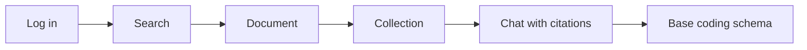
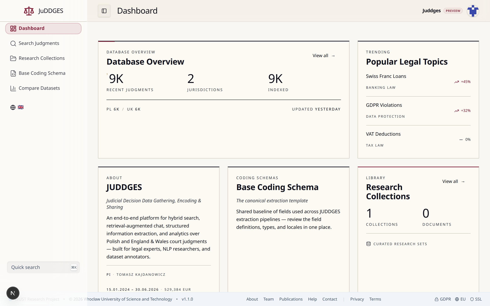
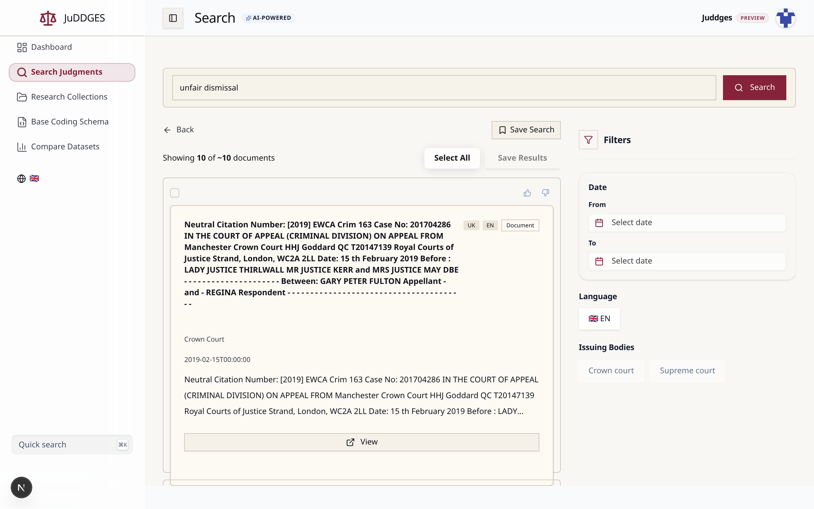
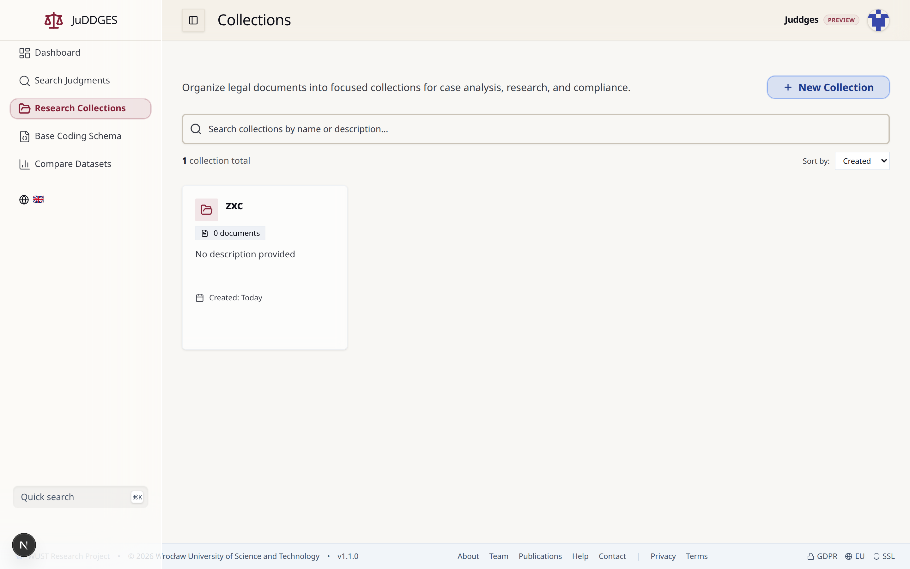
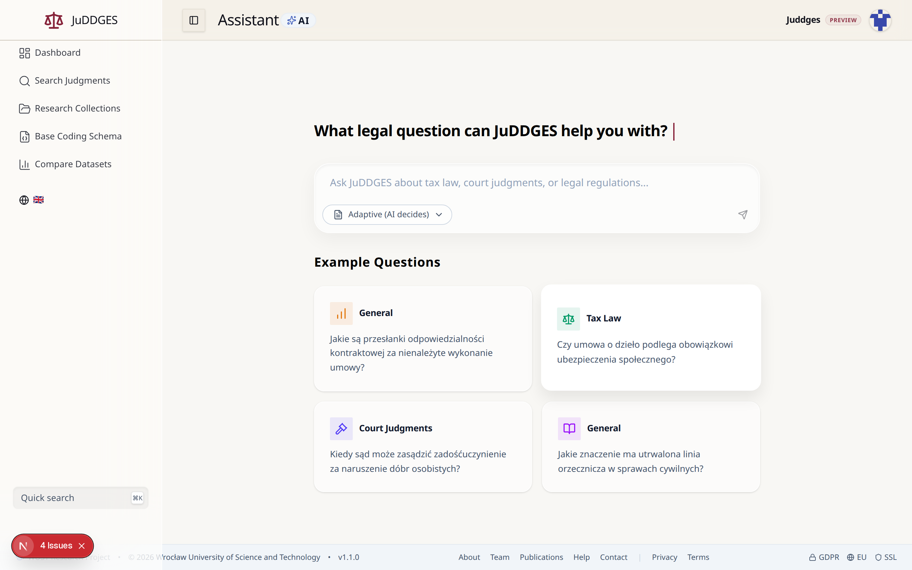

# First 30 minutes with JUDDGES

A four-step tour for legal researchers logging in for the first time. By the
end you will have searched the corpus, saved a research collection, asked a
question with cited sources, and reviewed the base coding schema used across
JUDDGES extraction pipelines.

> **In-app version:** the live, clickable equivalent of this tutorial lives at
> [`/onboarding`](https://juddges.com/onboarding) inside the app. Both surfaces
> share the same screenshots, regenerated by `npm run docs:screens`.

## What you'll learn



| Step | Goal | Time |
|---|---|---|
| 01 | Search the corpus with hybrid semantic + full-text ranking | ~8 min |
| 02 | Build a research collection | ~5 min |
| 03 | Ask a question with cited sources | ~10 min |
| 04 | Read the base coding schema | ~7 min |

## Prerequisites

- A JUDDGES account (request access at
  [lukasz.augustyniak@pwr.edu.pl](mailto:lukasz.augustyniak@pwr.edu.pl)).
- A modern browser. Firefox, Chrome, Safari, and Edge all work.
- Optional: a sample question or fact pattern from your research area. The
  tour works without one, but real research questions make Step 03 much more
  illustrative.

The dashboard is the home page after login. Below the headline statistics
you'll see the entry points referenced throughout this tutorial.



---

## Step 01 — Search the corpus

JUDDGES runs **hybrid search**: every query is scored against both a
semantic embedding index and a Postgres full-text index, then the two
rankings are blended. The practical consequence: you can phrase queries as
you would ask a colleague (`"liability for breach of an employment
contract"`) rather than reverse-engineering keyword forms.



### Walk through the example

The screenshot above shows the result of searching for
`unfair dismissal` — try it yourself at
[`/search?q=unfair+dismissal`](https://juddges.com/search?q=unfair+dismissal).

1. **Read the query bar.** Anything you type is run as a hybrid query by
   default. The `AI-POWERED` badge next to the page title indicates
   semantic ranking is active.
2. **Scan the result card.** Each result shows the jurisdiction (`UK`),
   the document language (`EN`), and the document type (`Document` or
   `Judgment`) as small badges. The court and the publication date appear
   below the case identifier.
3. **Open the filters panel.** On the right you can constrain results by
   **Date** range, **Language**, and **Issuing Bodies** (Crown Court,
   Supreme Court, …). Filters compose with the query — the result count
   in `Showing X of ~N documents` updates as you adjust them.
4. **Save the search.** The `Save Search` button (top right) persists the
   query + filters as a *Saved Search*, accessible from the left sidebar.
5. **Open a judgment.** Click `View` on any card to read the full text
   with cited legislation and AI-extracted highlights surfaced as a
   side panel.

### Tips for legal-research queries

- **Concept first, keyword second.** Semantic ranking rewards conceptual
  phrasing. `"compensation for breach of fiduciary duty"` beats
  `"breach fiduciary"`.
- **Mix English and Polish.** The query is matched against both locales —
  use whichever language your fact pattern lives in.
- **Use the jurisdiction filter early.** Comparative research benefits
  from running the same query under PL and UK filters separately, then
  using collections (Step 02) to assemble the comparison.

### Where it lives

- Search page: [`/search`](https://juddges.com/search)
- Search architecture and ranking model:
  [`docs/architecture/SEARCH_ARCHITECTURE.md`](../architecture/SEARCH_ARCHITECTURE.md)
- Benchmark methodology:
  [`docs/explanation/search-benchmark-methodology.md`](../explanation/search-benchmark-methodology.md)

---

## Step 02 — Build a research collection

A **collection** is a named set of judgments. Use it as a working folder
for a research question, a comparative-law study, or a batch you intend to
run extraction over. Collections are persisted server-side and accessible
from the left sidebar.



### Walk through the example

Open [`/collections`](https://juddges.com/collections). The list shows
every collection on your account with its document count and creation
date.

1. **Create a collection.** Click `+ New Collection` (top right) and
   give it a name. Description is optional and can be edited inline
   afterwards by clicking the collection name on the detail page.
2. **Add judgments to it.** Three entry points:
    - From a search result: hover a result card and use the
      *Save to collection* affordance.
    - From an open document: the document toolbar exposes the same action.
    - From the collection detail page: the *Add documents* button accepts
      a list of judgment IDs, which is useful for importing curated
      sets.
3. **Search and sort collections.** When the list grows, the search box
   above the cards filters by name and description, and the *Sort by*
   dropdown switches between Created and Updated timestamps.
4. **Open a collection.** Clicking the card lands you on its detail page
   — a sortable, filterable table of the judgments in the set, with bulk
   actions in the toolbar.

### Workflow patterns

- **Per-question.** One collection per research question. Add anything
  potentially relevant during exploration; trim down at the end.
- **Comparative.** One collection per jurisdiction for the same fact
  pattern. Run identical searches under each filter, save to the
  matching collection.
- **Pre-extraction.** Build the collection first, then point an
  extraction job (see Step 04 on the base schema) at it. Collections
  are the canonical input unit for extraction pipelines.

### Where it lives

- Collections list: [`/collections`](https://juddges.com/collections)
- Collection detail: `/collections/{id}`
- API reference (programmatic access):
  [`docs/api/API_REFERENCE.md`](../api/API_REFERENCE.md)

---

## Step 03 — Ask a question with cited sources

The chat assistant is **retrieval-augmented**: each question is used to
retrieve the most relevant judgments from the corpus, those judgments are
fed to the LLM as context, and every sentence in the response is
grounded in a specific cited document. The cited-sources panel makes
that grounding inspectable.



### Walk through the example

Open [`/chat`](https://juddges.com/chat). On a fresh visit you'll see the
landing state pictured above.

1. **Pick or write a question.** Click one of the *Example Questions*
   cards to drop a doctrinal Polish-language question into the input.
   Replace it with your own if you have one in mind.
2. **Choose a response format.** The dropdown below the input
   (defaulting to *Adaptive*) lets the assistant pick between prose,
   list, table, or step-by-step answer based on the question. Override
   it if you want a specific shape.
3. **Send.** The answer streams in token-by-token. Below the answer, a
   *Sources* panel appears with the judgments that grounded the
   response. Each entry shows the case identifier, jurisdiction, and a
   short snippet.
4. **Follow a citation.** Click an entry in the *Sources* panel — you
   land on the corresponding document view with the cited paragraph
   highlighted. The browser back button returns you to the conversation
   with state preserved.
5. **Keep iterating.** Follow-up turns reuse the context. Ask
   "What's the strongest counterargument?" or "Which of these is
   most recent?" to drill in.

### What it's good for, and what it isn't

- **Good for**: doctrinal exploration, summarising long fact patterns,
  comparing how different judgments treat the same issue, generating
  draft research outlines with anchored citations.
- **Not a substitute for**: reading the cited judgment in full,
  professional legal advice, or systematic coverage of every relevant
  case. The retrieval recall is good but not exhaustive — use Search
  (Step 01) and Collections (Step 02) for that.

### Where it lives

- Chat: [`/chat`](https://juddges.com/chat)
- Chat history: each conversation is persisted; access it from the
  *Chat history* sub-section of the chat sidebar.
- Coding-scheme reference for citation-anchored extraction:
  [`docs/how-to/CODING_SCHEME_USAGE.md`](../how-to/CODING_SCHEME_USAGE.md)

---

## Step 04 — Read the base coding schema

A **coding schema** is the field list an extraction job will produce —
the columns of the eventual table. The *Base Judgment Extraction
Schema* (`universal_legal_document_base_schema`) is the canonical
reference: 51 fields covering case identifiers, parties, court
hierarchy, dates, legal grounds, and outcomes, with parallel English and
Polish descriptions.


### Walk through the example

Open [`/schemas/base`](https://juddges.com/schemas/base).

1. **Read the header.** The `universal_legal_document_base_schema`
   identifier is the canonical name used everywhere — JSON exports,
   API responses, indexing in Meilisearch. The `51 fields · 51 required`
   badge tells you every field is mandatory in the base profile.
2. **Switch the language.** The *Schema language* toggle swaps every
   description between English and Polish. Field keys themselves stay
   stable; only the human-facing strings change.
3. **Search the fields.** The *Search all fields…* box filters the
   table by field name, type, or description. Try `"date"` to see every
   date-typed field, or `"judge"` to find judge-related fields across
   the appellate, lower, and panel levels.
4. **Inspect a row.** Each row shows the field name, its type
   (`text`, `number`, `list`, `boolean`, `enum`), and its description.
   `enum` fields enumerate their allowed values when expanded.
5. **Switch to JSON.** The *JSON* tab shows the same schema in its raw
   JSON-Schema form. Use the *Copy JSON* or *Download JSON* buttons
   (top right) to take a copy with you when designing a derivative
   schema.

### When to extend versus reuse

- **Reuse the base schema** if your research question is well-covered
  by the existing fields. Doing so makes your extracted data joinable
  with everyone else's — the whole point of having a canonical schema.
- **Extend it** (add fields on top) when your question needs
  domain-specific fields the base doesn't have. Keep the base fields
  unchanged so your output remains forward-compatible.
- **Avoid forking from scratch** unless you have a reason that
  doesn't fit either of the above. A clean fork severs the join.

### Where it lives

- Base schema page: [`/schemas/base`](https://juddges.com/schemas/base)
- Coding-scheme usage guide:
  [`docs/how-to/CODING_SCHEME_USAGE.md`](../how-to/CODING_SCHEME_USAGE.md)
- Polish dataset curation (real-world application of the base schema):
  [`docs/how-to/polish-dataset-curation.md`](../how-to/polish-dataset-curation.md)

---

## Next steps

- Want to extract structured data from your collection? See the
  *Coding Scheme Usage* how-to (extraction routes are currently hidden from
  the sidebar but reachable by URL during the preview phase).
- Want the corpus-wide view? Open
  [`/statistics`](https://juddges.com/statistics).
- Found something missing or confusing? File feedback via the in-app feedback
  panel or open an issue on
  [GitHub](https://github.com/pwr-ai/juddges-app/issues).

## Regenerating the screenshots in this tutorial

The PNGs referenced here are produced by a Playwright script:

```bash
cd frontend
npm run docs:screens                   # regenerate all
npm run docs:screens -- dashboard      # regenerate one step
```

The script logs in via the real Supabase auth UI using
`TEST_USER_EMAIL` / `TEST_USER_PASSWORD` from `.env`, walks each step, and
writes PNGs to `frontend/public/docs/onboarding/`. The same files are served
to both this tutorial and the in-app `/onboarding` route, so they never drift
out of sync.
