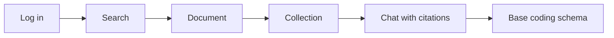

# First 30 minutes with JUDDGES

A four-step tour for legal researchers logging in for the first time. By the
end you will have searched the corpus, saved a research collection, asked a
question with cited sources, and reviewed the base coding schema used across
JUDDGES extraction pipelines.

> **In-app version:** the live, clickable equivalent of this tutorial lives at
> [`/onboarding`](https://juddges.com/onboarding) inside the app. Both surfaces
> share the same screenshots, regenerated by `npm run docs:screens`.

## What you'll learn



| Step | Goal | Time |
|---|---|---|
| 01 | Search the corpus with hybrid semantic + full-text ranking | ~8 min |
| 02 | Build a research collection | ~5 min |
| 03 | Ask a question with cited sources | ~10 min |
| 04 | Read the base coding schema | ~7 min |

## Prerequisites

- A JUDDGES account (request access at
  [lukasz.augustyniak@pwr.edu.pl](mailto:lukasz.augustyniak@pwr.edu.pl)).
- A modern browser. Firefox, Chrome, Safari, and Edge all work.
- Optional: a sample question or fact pattern from your research area. The
  tour works without one, but real research questions make Step 03 much more
  illustrative.

The dashboard is the home page after login. Below the headline statistics
you'll see the entry points referenced throughout this tutorial.


---

## Step 01 — Search the corpus

*Content for this step is captured in Phase 2 of the onboarding plan. Until
then, see the in-app summary at [`/onboarding`](https://juddges.com/onboarding).*

### What to try

- Phrase a query as you would ask a colleague — semantic ranking surfaces
  concept matches, not just keyword hits.
- Combine the query with the **PL / UK** jurisdiction filter, court level,
  and date range.
- Open a result to read the full judgment.

### Where it lives

- Search page: [`/search`](https://juddges.com/search)
- Search architecture explained: see
  [`docs/architecture/SEARCH_ARCHITECTURE.md`](../architecture/SEARCH_ARCHITECTURE.md).

---

## Step 02 — Build a research collection

*Content for this step is captured in Phase 3.*

### What to try

- Save a search result straight from the list, or from inside a document.
- Rename, describe, and re-order collections from the Library sidebar.

### Where it lives

- Collections: [`/collections`](https://juddges.com/collections)

---

## Step 03 — Ask a question with cited sources

*Content for this step is captured in Phase 4.*

### What to try

- Ask a doctrinal question in Polish or English.
- Click each citation in the sources panel — it lands you on the cited
  paragraph in the source judgment.

### Where it lives

- Chat: [`/chat`](https://juddges.com/chat)
- RAG citations explainer (coming in Phase 4): see
  `docs/explanation/rag-citations-explained.md`.

---

## Step 04 — Read the base coding schema

*Content for this step is captured in Phase 5.*

### What to try

- Browse the field list with descriptions and example values.
- Switch between English and Polish locale variants.

### Where it lives

- Base schema: [`/schemas/base`](https://juddges.com/schemas/base)
- Coding scheme usage: see
  [`docs/how-to/CODING_SCHEME_USAGE.md`](../how-to/CODING_SCHEME_USAGE.md).

---

## Next steps

- Want to extract structured data from your collection? See the
  *Coding Scheme Usage* how-to (extraction routes are currently hidden from
  the sidebar but reachable by URL during the preview phase).
- Want the corpus-wide view? Open
  [`/statistics`](https://juddges.com/statistics).
- Found something missing or confusing? File feedback via the in-app feedback
  panel or open an issue on
  [GitHub](https://github.com/pwr-ai/juddges-app/issues).

## Regenerating the screenshots in this tutorial

The PNGs referenced here are produced by a Playwright script:

```bash
cd frontend
npm run docs:screens                   # regenerate all
npm run docs:screens -- dashboard      # regenerate one step
```

The script logs in via the real Supabase auth UI using
`TEST_USER_EMAIL` / `TEST_USER_PASSWORD` from `.env`, walks each step, and
writes PNGs to `frontend/public/docs/onboarding/`. The same files are served
to both this tutorial and the in-app `/onboarding` route, so they never drift
out of sync.
